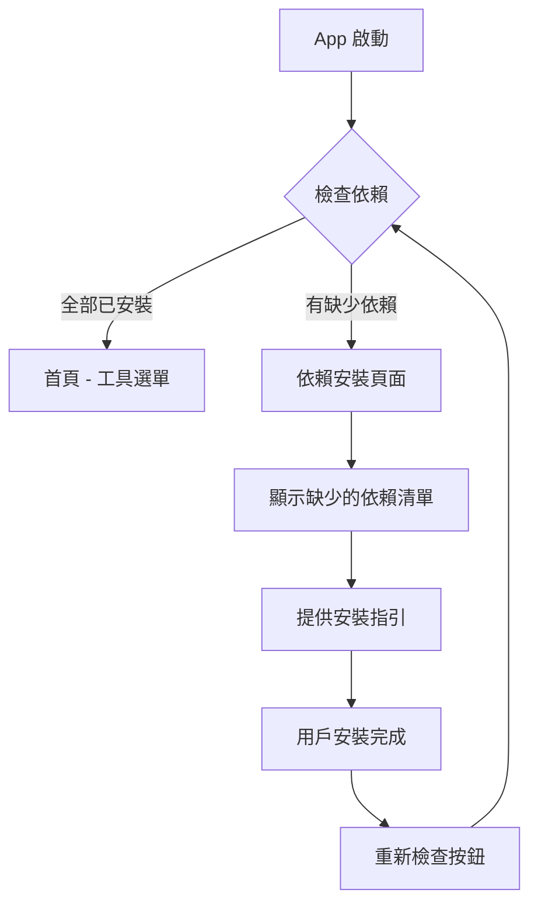

# VIP F2E Tool - 整合實作計畫

將三個獨立的 Flutter 工具整合成一個統一的應用程式。

## 專案資訊

| 項目 | 值 |
|------|-----|
| App Name | VIP F2E Tool |
| Package Name | vip_f2e_tool |
| Bundle ID | com.en96321.vipF2eTool |
| Platform | macOS |

---

## 啟動流程設計



### 依賴檢查機制

App 啟動時會檢查以下依賴項目：

| 依賴 | 檢查方式 | 安裝指引 |
|------|----------|----------|
| `gh` (GitHub CLI) | `which gh` | `brew install gh` + `gh auth login` |
| `git` | `which git` | Xcode Command Line Tools |

> [!TIP]
> 此設計支援未來擴展，新增工具時只需在 `DependencyService` 中加入新的依賴定義即可。

---

## 現有工具分析

### Tool 1: PR Commit Check (`pr_compare_tool`)
**功能**: 比對 Staging 和 Production PR 的 commit

**Dependencies**:
- `cupertino_icons: ^1.0.8`

**主要元件**:
- `GithubService` - 使用 `gh` CLI 呼叫 GitHub API
- `ComparisonService` - 比對 cherry-pick commits
- `HomeScreen` - 輸入 PR URL 並顯示比對結果

---

### Tool 2: RedPen CI (`redpen_ci_app`)
**功能**: 靜態程式碼分析工具

**Dependencies**:
- `cupertino_icons: ^1.0.8`
- `shared_preferences: ^2.2.2`
- `intl: ^0.19.0`

**主要元件**:
- `GitService` - Git 操作與 `gh` CLI
- `StorageService` - 儲存 Repository 設定
- `HistoryService` - 掃描歷史紀錄
- `CommandService` - 執行 shell 指令
- Screens: `HomeScreen`, `ScanScreen`, `SettingsScreen`, `HistoryScreen`

---

### Tool 3: Cherry Pick (`cherry_pick_app`)
**功能**: Cherry-pick 發車工具

**Dependencies**:
- `flutter_riverpod: ^2.4.9`
- `shared_preferences: ^2.2.2`
- `path_provider: ^2.1.1`
- `file_picker: ^6.1.1`
- `url_launcher: ^6.2.2`
- `cupertino_icons: ^1.0.8`

**主要元件**:
- `CherryPickManager` - Cherry-pick 操作管理
- `AppState` (Riverpod Provider) - 狀態管理
- Widgets: `ConfigPanel`, `CommitList`, `LogPanel`, `ConflictPanel`

---

## Proposed Changes

### 1. 專案初始化

#### [NEW] [vip_f2e_tool/](file:///Users/pedro.yang/Documents/vip-f2e-tool/vip_f2e_tool/)

建立新的 Flutter macOS 專案：
```bash
flutter create --org com.en96321 --platforms=macos vip_f2e_tool
```

---

### 2. 合併 Dependencies

#### [NEW] [pubspec.yaml](file:///Users/pedro.yang/Documents/vip-f2e-tool/vip_f2e_tool/pubspec.yaml)

合併所有相依套件：
```yaml
dependencies:
  flutter:
    sdk: flutter
  
  # UI
  cupertino_icons: ^1.0.8
  
  # State Management (from cherry_pick_app)
  flutter_riverpod: ^2.4.9
  
  # Storage
  shared_preferences: ^2.2.2
  path_provider: ^2.1.1
  
  # Utilities
  intl: ^0.19.0
  file_picker: ^6.1.1
  url_launcher: ^6.2.2
```

---

### 3. 專案結構設計

```
lib/
├── main.dart                 # App 入口 (依賴檢查)
├── app.dart                  # MaterialApp 設定
│
├── core/                     # 共用核心
│   ├── models/
│   │   └── dependency.dart         # 依賴定義模型
│   ├── services/
│   │   ├── command_service.dart    # 執行 shell 指令
│   │   ├── dependency_service.dart # 依賴檢查服務 ⭐ NEW
│   │   ├── git_service.dart        # Git 操作
│   │   └── storage_service.dart    # 本地儲存
│   └── theme/
│       └── app_theme.dart          # 統一主題
│
├── features/                 # 功能模組
│   ├── startup/              # 啟動檢查 ⭐ NEW
│   │   └── screens/
│   │       └── dependency_check_screen.dart
│   │
│   ├── home/                 # 首頁 (工具選單)
│   │   └── screens/
│   │       └── home_screen.dart
│   │
│   ├── pr_compare/           # Tool 1: PR 比對
│   │   ├── models/
│   │   ├── services/
│   │   └── screens/
│   │
│   ├── redpen_ci/            # Tool 2: 靜態分析
│   │   ├── models/
│   │   ├── services/
│   │   └── screens/
│   │
│   └── cherry_pick/          # Tool 3: 發車工具
│       ├── models/
│       ├── services/
│       ├── providers/
│       ├── widgets/
│       └── screens/
│
└── shared/                   # 共用 widgets
    └── widgets/
```

---

### 4. 首頁導航設計

建立一個工具選擇首頁，以卡片形式展示三個工具：

```dart
// features/home/screens/home_screen.dart
class HomeScreen extends StatelessWidget {
  // 三個工具卡片：
  // 1. PR Commit 比對 - 深紫色
  // 2. RedPen CI 靜態分析 - 藍色
  // 3. 發車工具 - 橙色
}
```

---

### 5. 各工具移植計畫

#### Tool 1: PR Compare
| 來源 | 目標 |
|------|------|
| `pr_compare_tool/lib/models/` | `features/pr_compare/models/` |
| `pr_compare_tool/lib/services/` | `features/pr_compare/services/` |
| `pr_compare_tool/lib/screens/home_screen.dart` | `features/pr_compare/screens/pr_compare_screen.dart` |

#### Tool 2: RedPen CI
| 來源 | 目標 |
|------|------|
| `redpen_ci_app/lib/models/` | `features/redpen_ci/models/` |
| `redpen_ci_app/lib/services/git_service.dart` | `core/services/git_service.dart` (共用) |
| `redpen_ci_app/lib/services/command_service.dart` | `core/services/command_service.dart` (共用) |
| `redpen_ci_app/lib/services/storage_service.dart` | `features/redpen_ci/services/redpen_storage_service.dart` |
| `redpen_ci_app/lib/screens/*` | `features/redpen_ci/screens/*` |

#### Tool 3: Cherry Pick
| 來源 | 目標 |
|------|------|
| `cherry_pick_app/lib/models/` | `features/cherry_pick/models/` |
| `cherry_pick_app/lib/services/` | `features/cherry_pick/services/` |
| `cherry_pick_app/lib/providers/` | `features/cherry_pick/providers/` |
| `cherry_pick_app/lib/widgets/` | `features/cherry_pick/widgets/` |
| `cherry_pick_app/lib/screens/home_screen.dart` | `features/cherry_pick/screens/cherry_pick_screen.dart` |

---

### 6. 主題統一

統一使用深色主題（參考 RedPen CI 的設計）：

```dart
// core/theme/app_theme.dart
class AppTheme {
  static ThemeData get dark => ThemeData.dark().copyWith(
    colorScheme: ColorScheme.dark(
      primary: Colors.blueAccent,
      secondary: Colors.blueAccent,
      surface: Color(0xFF1A1A2E),
    ),
    scaffoldBackgroundColor: Color(0xFF1A1A2E),
    appBarTheme: AppBarTheme(
      backgroundColor: Color(0xFF16213E),
    ),
    cardTheme: CardTheme(
      color: Color(0xFF16213E),
    ),
  );
}
```

---

## Verification Plan

### Automated Tests
```bash
# 建置測試
flutter build macos

# 執行單元測試
flutter test
```

### Manual Verification
1. 啟動應用程式，確認依賴檢查正常運作
2. 模擬缺少依賴時，顯示安裝指引頁面
3. 點擊「重新檢查」按鈕，確認可以重新檢測
4. 依賴齊全時，自動進入首頁
5. 測試 PR 比對功能
6. 測試 RedPen CI 掃描功能
7. 測試發車工具的 cherry-pick 功能
8. 確認導航返回首頁正常

---

## 預估工作量

| 階段 | 預估時間 |
|------|----------|
| 專案初始化 | 5 分鐘 |
| 依賴檢查功能 | 10 分鐘 |
| 移植 PR Compare | 10 分鐘 |
| 移植 RedPen CI | 15 分鐘 |
| 移植 Cherry Pick | 15 分鐘 |
| 整合調整 | 10 分鐘 |
| 測試驗證 | 10 分鐘 |
| **總計** | **~75 分鐘** |

